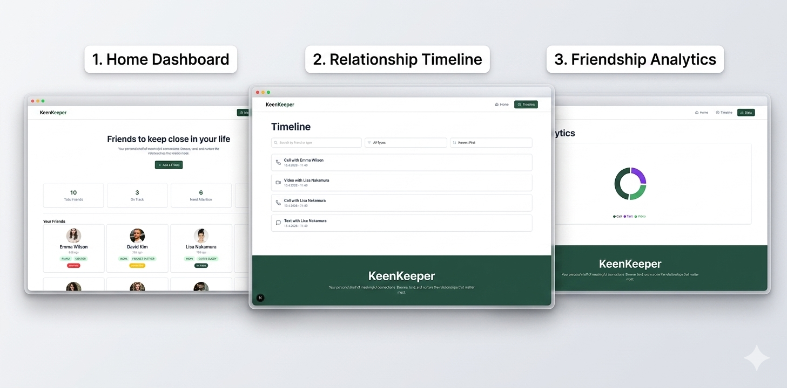

# 🌿 KeenKeeper

<p align="center">
  <b>A friendship tracker web app to help users stay connected with meaningful relationships.</b>
</p>

<p align="center">
  <a href="https://keep-keen-project-7-alpha.vercel.app/" target="_blank">
    
  </a>
  
  
  
</p>

---

## 📸 Project Preview

> Save your project screenshot inside your repo, for example in `public/preview.png`, then keep this line:



---

## 🔗 Live Site

**Live Link:**  
https://keep-keen-project-7-alpha.vercel.app/

---

## 🧠 About the Project

**KeenKeeper** is a modern friendship tracking web application built with **Next.js**.  
It helps users manage their meaningful relationships by viewing friend details, logging interactions, checking relationship timelines, and analyzing friendship activity visually.

This project was built as an academic assignment with focus on:
- clean UI design
- Next.js App Router
- reusable components
- Context API state management
- responsive layout
- timeline interaction tracking

---

## ✨ Features

- 🏠 **Home Dashboard**
  - Clean hero banner
  - Summary cards
  - Friend card grid from JSON data

- 👤 **Friend Details Page**
  - Profile image, name, status, tags, bio, and email
  - Relationship goal section
  - Quick Check-In actions

- 📜 **Relationship Timeline**
  - Logs interaction history
  - Search by friend name or interaction type
  - Filter by Call, Text, and Video
  - Sort by newest or oldest

- 📊 **Friendship Analytics**
  - Pie chart for interaction types
  - Visual overview using Recharts

- 🔔 **Interactive UX**
  - Toast notifications on quick check-in
  - Loading animation while fetching friend data

- ❌ **Custom 404 Page**
  - Handles unknown or invalid routes

- 📱 **Responsive Design**
  - Works on mobile, tablet, and desktop

---

## 🛠️ Technologies Used

- **Next.js**
- **React**
- **Tailwind CSS**
- **React Icons**
- **React Toastify**
- **Recharts**
- **React Loader Spinner**
- **Context API**

---

## 📂 Folder Structure

```bash
src/
├── app/
│   ├── friends/
│   │   └── [friendId]/
│   │       ├── loading.jsx
│   │       └── page.jsx
│   ├── stats/
│   │   └── page.jsx
│   ├── timeline/
│   │   └── page.jsx
│   ├── globals.css
│   ├── layout.js
│   ├── not-found.jsx
│   └── page.js
│
├── Components/
│   ├── FriendDetails/
│   │   └── QuickCheckIn.jsx
│   ├── Home/
│   │   ├── Banner.jsx
│   │   ├── FriendCard.jsx
│   │   ├── FrindCardsGrid.jsx
│   │   └── SummaryCards.jsx
│   ├── Shared/
│   │   ├── Footer.jsx
│   │   ├── Loader.jsx
│   │   └── Navbar.jsx
│   └── Stats/
│       └── InteractionPieChart.jsx
│
├── context/
│   └── TimelineContext.jsx
│
public/
└── friendsData/
    └── FriendsData.json